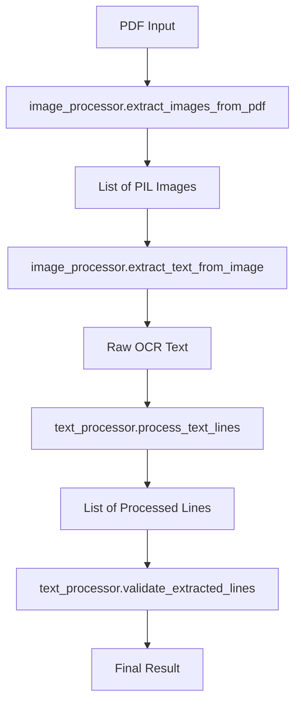

# OCR PDF Reader Architecture

## Overview

The OCR PDF Reader was structured following clean code principles and modular architecture, separating responsibilities into distinct modules to facilitate maintenance, testing, and extensibility.

## Module Structure

### 📦 `src/ocr_pdf_reader/`

#### `__init__.py`
- **Function**: Package entry point
- **Responsibilities**:
  - Define project metadata (version, author, description)
  - Export main public APIs
  - Configure imports to facilitate usage

#### `core.py`
- **Function**: Main module that orchestrates the entire process
- **Responsibilities**:
  - Integrate functionalities from other modules
  - Implement main function `extract_text_from_pdf()`
  - Convenience function `extract_and_save()`
  - Manage main processing flow

#### `image_processor.py`
- **Function**: Image processing and OCR
- **Responsibilities**:
  - Extract images from PDF files
  - Preprocess images (threshold, noise removal)
  - Apply OCR using Tesseract
  - Check Tesseract installation

#### `text_processor.py`
- **Function**: Text processing and cleaning
- **Responsibilities**:
  - Process raw OCR text
  - Apply regex to extract relevant content
  - Remove numeric codes and keep descriptions
  - Validate and filter extracted lines
  - Handle broken lines

#### `cli.py`
- **Function**: Command line interface
- **Responsibilities**:
  - Command line argument parsing
  - Interactive mode and CLI mode
  - Display help and version
  - Handle user errors

#### `__main__.py`
- **Function**: Entry point for module execution
- **Responsibilities**:
  - Allow execution with `python -m ocr_pdf_reader`
  - Delegate to CLI or interactive mode

### 🧪 `tests/`

#### `test_text_processor.py`
- **Function**: Unit tests for text processing
- **Coverage**:
  - Test different input formats
  - Validation of acronym maintenance
  - Duplicate removal
  - Line validation

### 📚 `examples/`

#### `example.py`
- **Function**: Demonstrate programmatic library usage
- **Content**: Practical examples of how to use the APIs

### ⚙️ `config/`

#### `settings.py`
- **Function**: Centralized configurations
- **Content**:
  - OCR parameters
  - Processing settings
  - Regex patterns
  - Logging configurations

## Data Flow



## Design Principles

### 1. **Separation of Concerns**
- Each module has a specific responsibility
- Well-defined interfaces between modules
- Low coupling, high cohesion

### 2. **Testability**
- Small and focused functions
- Injectable dependencies
- Unit tests for critical functionalities

### 3. **Extensibility**
- Centralized configurations
- Configurable regex patterns
- Support for multiple languages

### 4. **Usability**
- Multiple interfaces (CLI, programmatic, interactive)
- Informative messages
- Graceful error handling

## Configuration and Customization

### Regex Patterns
The `text_processor` module uses configurable regex patterns for different formats:

```python
REGEX_PATTERNS = {
    'standard': r'(\d+(?:[\.\,]\d+)*(?:[\.\,]\d+)*)\s*-\s*([^0-9]+?)(?=\s+\d+(?:[\.\,]\d+)*\s*-|\s*$)',
    'simple': r'(\d+)\s*-\s*(.+?)(?=\s+\d+\s*-|\s*$)',
    'complex': r'(\d+[\.\,\-]+[\d\.\,\-]*)\s*-\s*(.+?)(?=\s+\d+[\.\,\-]+[\d\.\,\-]*\s*-|\s*$)',
}
```

### OCR Settings
Tesseract parameters are configurable:

```python
OCR_CONFIG = {
    'default_language': 'eng',
    'custom_config': r'--oem 3 --psm 6',
    'supported_languages': ['eng', 'por', 'spa', 'fra', 'deu'],
}
```

## Compatibility

### Python Versions
- Python 3.9+
- Compatible with UV and pip

### Main Dependencies
- PyMuPDF: PDF manipulation
- Pytesseract: Python interface for Tesseract
- Pillow: Image processing
- OpenCV: Advanced image preprocessing

## Entry Points

### 1. Compatibility Script
```bash
python main.py
```

### 2. Python Module
```bash
python -m ocr_pdf_reader file.pdf
```

### 3. Programmatic Usage
```python
from ocr_pdf_reader import extract_text_from_pdf
result = extract_text_from_pdf("file.pdf")
```

### 4. CLI with UV
```bash
uv run python -m ocr_pdf_reader file.pdf -o result.txt
```

## Future Extensions

The modular architecture easily allows:

1. **New Image Processors**: Add preprocessing algorithms
2. **New Input Formats**: Support for other file types
3. **Custom Text Processors**: Specific regex patterns
4. **Alternative OCR Backends**: Beyond Tesseract
5. **Structured Outputs**: JSON, XML, etc.
6. **Web Interface**: Flask/FastAPI wrapper
7. **Graphical Interface**: Tkinter or Qt

## Implemented Best Practices

- ✅ **Type Hints**: All functions have type annotations
- ✅ **Docstrings**: Complete function documentation
- ✅ **Error Handling**: Robust error handling
- ✅ **Logging**: Configurable logging system
- ✅ **Configuration**: Externalized parameters
- ✅ **Testability**: Easily testable code
- ✅ **PEP 8**: Following Python standards
- ✅ **Backward Compatibility**: Legacy script maintained 