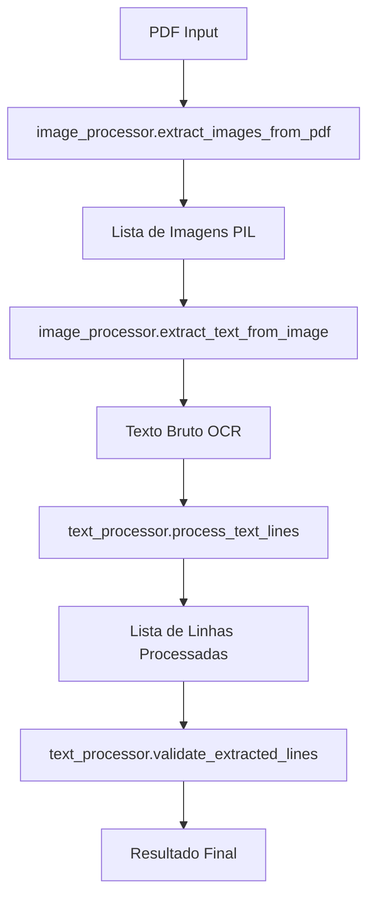

# Arquitetura do OCR PDF Reader

## Visão Geral

O OCR PDF Reader foi estruturado seguindo princípios de código limpo e arquitetura modular, separando responsabilidades em módulos distintos para facilitar manutenção, testes e extensibilidade.

## Estrutura de Módulos

### 📦 `src/ocr_pdf_reader/`

#### `__init__.py`
- **Função**: Ponto de entrada do pacote
- **Responsabilidades**:
  - Definir metadata do projeto (versão, autor, descrição)
  - Exportar APIs públicas principais
  - Configurar importações para facilitar uso

#### `core.py`
- **Função**: Módulo principal que orquestra todo o processo
- **Responsabilidades**:
  - Integrar funcionalidades dos outros módulos
  - Implementar função principal `extract_text_from_pdf()`
  - Função de conveniência `extract_and_save()`
  - Gerenciar fluxo principal do processamento

#### `image_processor.py`
- **Função**: Processamento de imagens e OCR
- **Responsabilidades**:
  - Extrair imagens de arquivos PDF
  - Pré-processar imagens (threshold, remoção de ruído)
  - Aplicar OCR usando Tesseract
  - Verificar instalação do Tesseract

#### `text_processor.py`
- **Função**: Processamento e limpeza de texto
- **Responsabilidades**:
  - Processar texto bruto do OCR
  - Aplicar regex para extrair conteúdo relevante
  - Remover códigos numéricos e manter descrições
  - Validar e filtrar linhas extraídas
  - Lidar com linhas quebradas

#### `cli.py`
- **Função**: Interface de linha de comando
- **Responsabilidades**:
  - Parsing de argumentos de linha de comando
  - Modo interativo e modo CLI
  - Exibir help e versão
  - Tratamento de erros de usuário

#### `__main__.py`
- **Função**: Ponto de entrada para execução como módulo
- **Responsabilidades**:
  - Permitir execução com `python -m ocr_pdf_reader`
  - Delegar para CLI ou modo interativo

### 🧪 `tests/`

#### `test_text_processor.py`
- **Função**: Testes unitários para processamento de texto
- **Cobertura**:
  - Teste de diferentes formatos de entrada
  - Validação de manutenção de siglas
  - Remoção de duplicatas
  - Validação de linhas

### 📚 `examples/`

#### `example.py`
- **Função**: Demonstrar uso programático da biblioteca
- **Conteúdo**: Exemplos práticos de como usar as APIs

### ⚙️ `config/`

#### `settings.py`
- **Função**: Configurações centralizadas
- **Conteúdo**:
  - Parâmetros de OCR
  - Configurações de processamento
  - Padrões de regex
  - Configurações de logging

## Fluxo de Dados



## Princípios de Design

### 1. **Separação de Responsabilidades**
- Cada módulo tem uma responsabilidade específica
- Interfaces bem definidas entre módulos
- Baixo acoplamento, alta coesão

### 2. **Facilidade de Teste**
- Funções pequenas e focadas
- Dependências injetáveis
- Testes unitários para funcionalidades críticas

### 3. **Extensibilidade**
- Configurações centralizadas
- Padrões de regex configuráveis
- Suporte a múltiplos idiomas

### 4. **Usabilidade**
- Múltiplas interfaces (CLI, programática, interativa)
- Mensagens informativas
- Tratamento gracioso de erros

## Configuração e Personalização

### Padrões de Regex
O módulo `text_processor` usa padrões regex configuráveis para diferentes formatos:

```python
REGEX_PATTERNS = {
    'standard': r'(\d+(?:[\.\,]\d+)*(?:[\.\,]\d+)*)\s*-\s*([^0-9]+?)(?=\s+\d+(?:[\.\,]\d+)*\s*-|\s*$)',
    'simple': r'(\d+)\s*-\s*(.+?)(?=\s+\d+\s*-|\s*$)',
    'complex': r'(\d+[\.\,\-]+[\d\.\,\-]*)\s*-\s*(.+?)(?=\s+\d+[\.\,\-]+[\d\.\,\-]*\s*-|\s*$)',
}
```

### Configurações de OCR
Parâmetros do Tesseract são configuráveis:

```python
OCR_CONFIG = {
    'default_language': 'por',
    'custom_config': r'--oem 3 --psm 6',
    'supported_languages': ['por', 'eng', 'spa', 'fra', 'deu'],
}
```

## Compatibilidade

### Versões Python
- Python 3.9+
- Compatível com UV e pip

### Dependências Principais
- PyMuPDF: Manipulação de PDFs
- Pytesseract: Interface Python para Tesseract
- Pillow: Processamento de imagens
- OpenCV: Pré-processamento avançado de imagens

## Pontos de Entrada

### 1. Script de Compatibilidade
```bash
python main.py
```

### 2. Módulo Python
```bash
python -m ocr_pdf_reader arquivo.pdf
```

### 3. Uso Programático
```python
from ocr_pdf_reader import extract_text_from_pdf
result = extract_text_from_pdf("arquivo.pdf")
```

### 4. CLI com UV
```bash
uv run python -m ocr_pdf_reader arquivo.pdf -o resultado.txt
```

## Futuras Extensões

A arquitetura modular permite facilmente:

1. **Novos Processadores de Imagem**: Adicionar algoritmos de pré-processamento
2. **Novos Formatos de Entrada**: Suporte a outros tipos de arquivo
3. **Processadores de Texto Personalizados**: Regex patterns específicos
4. **Backends de OCR Alternativos**: Além do Tesseract
5. **Saídas Estruturadas**: JSON, XML, etc.
6. **Interface Web**: Flask/FastAPI wrapper
7. **Interface Gráfica**: Tkinter ou Qt

## Melhores Práticas Implementadas

- ✅ **Type Hints**: Todas as funções têm anotações de tipo
- ✅ **Docstrings**: Documentação completa de funções
- ✅ **Error Handling**: Tratamento robusto de erros
- ✅ **Logging**: Sistema de logs configurável
- ✅ **Configuração**: Parâmetros externalizados
- ✅ **Testabilidade**: Código facilmente testável
- ✅ **PEP 8**: Seguindo padrões Python
- ✅ **Backward Compatibility**: Script legado mantido 